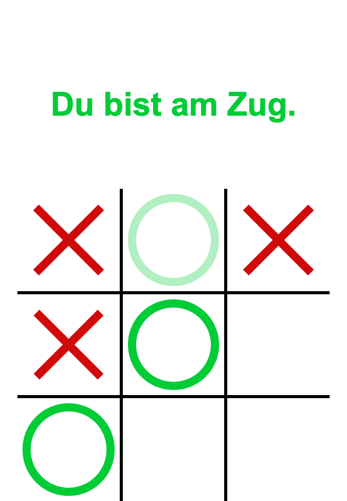

# TicTacToe Spiel

## Spiele gegen einen Computergegner

Dieses Spiel ist ein "Learning by Doing" Projekt. Umgesetzt ist das Spiel mit HTML, CSS und Javascript.

Der Spieler spielt gegen den Computer. 
Wer zuerst drei Spielsteine in einer Reihe gesetzt hat, gewinnt.
Der Code verhindert das setzen auf bereits belegte Felder. Er prüft, ob das Spiel bereits gewonnen ist oder ob das Spiel unentschieden geendet ist. 
Unentschieden ist das Spiel, sobald alle Felder belegt sind, ohne dass eine Siegkombination erreicht wurde.

Vielen Dank an "Dev Planet Germany" für das tolle Tutorial.
(https://www.youtube.com/watch?v=sXnM5YYieHY&list=PLti-tLbwaZM67_jVf1MOHu1fHvDdjwI3z&index=14)